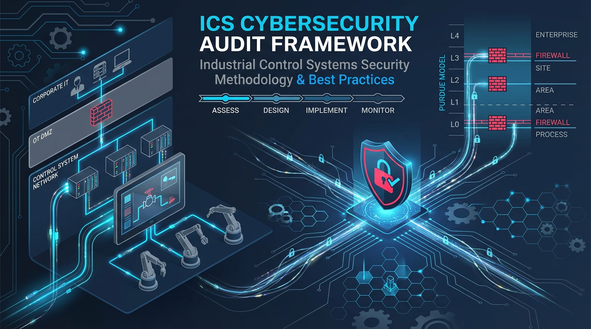
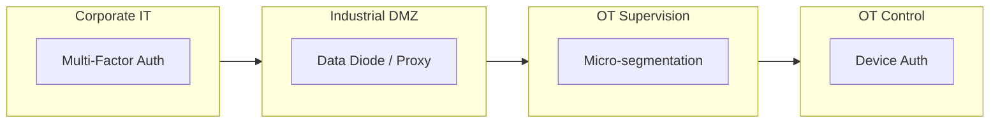

### ICS Cybersecurity Audit Framework

---



Industrial Control Systems Security Methodology & Best Practices

by [Frangel Barrera](https://github.com/frangelbarrera ) | Industrial Cybersecurity Researcher

Creating safer industrial environments through ethical research and proven methodologies

[](https://creativecommons.org/licenses/by-nc-sa/4.0/)
[](https://www.isa.org/)
[](https://csrc.nist.gov/pubs/sp/800/82/r3/final)
[](https://github.com/frangelbarrera/ICS-Cybersecurity-Audit)
[](https://github.com/frangelbarrera/ICS-Cybersecurity-Audit/pulls)

---

 Repository Purpose

This information repository serves as a comprehensive methodology guide for cybersecurity professionals conducting authorized security assessments of Industrial Control Systems (ICS) and Operational Technology (OT) environments. It focuses exclusively on defensive security practices, audit procedures, and risk mitigation strategies aligned with international industrial standards.

Core Value: Transforming theoretical OT security knowledge into actionable, auditable, and repeatable defense methodologies.

---

### Quick Start Guide
To begin using this framework in a professional engagement:
1. **Legal Prep:** Download and customize the `AUDIT_AUTHORIZATION_TEMPLATE.md` from the `/docs/legal/` directory.
2. **Asset Inventory:** Use the Phase 1 checklist to document Level 1-3 assets.
3. **Passive Baseline:** Deploy a network TAP and use the Wireshark profiles provided in the `/tools/` section.


---

 Scope & Applicability

This framework applies to Purdue Model Levels 0-3 and addresses:

System Layer	Components	Security Focus Area	
Level 3 - Site Operations	SCADA Servers, HMIs, Historians	Secure architecture, access control, patch management	
Level 2 - Area Supervision	Plant-floor HMIs, engineering workstations	Application security, secure remote access	
Level 1 - Basic Control	PLCs, RTUs, DCS controllers	Firmware integrity, protocol hardening	
Level 0 - Process	Sensors, actuators, drives	Physical security, secure commissioning	

Applicable Industries: Manufacturing, Energy, Water Treatment, Oil & Gas, Chemical Processing, Critical Infrastructure.

---

 Audit Methodology: 5-Phase Approach

Phase 1: Documentation & Scope Definition

Deliverables:
- `AUTHORIZATION_SCOPE.md` template (legal boundary definition)
- Asset inventory checklist
- Network architecture review guide

Key Activities:
- Establish audit boundaries per ISA/IEC 62443-3-2
- Document operational criticality (SL-Tags)
- Define acceptable testing windows (maintenance periods)

Phase 2: Passive Discovery & Baseline

Tools & Techniques:
- Network Mapping: Wireshark passive capture, ARP table analysis
- Traffic Profiling: Identify normal OT protocol patterns (Modbus, S7, EtherNet/IP)
- Configuration Review: Offline analysis of PLC/HMI backups

Safety Rule: Zero packets sent to control network during this phase

Phase 3: Configuration & Hardening Review

Checklists Provided:
- PLC/HMI default credential audit
- Firmware version vulnerability mapping (CVSS for OT)
- Firewall rule effectiveness analysis
- Access Control List (ACL) verification

Example Audit Snippet:

```bash
# Check for default Siemens S7 credentials (educational purpose)
# This command reads from an OFFLINE project file, NOT live PLC
grep -i "password" /path/to/offline/project.ap13
```

Phase 4: Controlled Security Validation

Authorized Testing Only:
- Protocol authentication verification (read-only commands)
- Network segmentation effectiveness tests
- Backup & restore procedure validation

Strict Prohibition: No exploitation, DoS, or modification attempts on operational systems.

Phase 5: Reporting & Remediation Roadmap

Templates Included:
- Executive summary for CISOs (business impact)
- Technical findings report with CVSS-OT scoring
- Remediation timeline aligned with IEC 62443 security levels
- Continuous monitoring recommendations

---

 Key Framework Components

1. OT Protocol Security Guides

Detailed security analysis for industrial protocols:

Protocol	Security Considerations	Hardening Steps	
Modbus TCP	No authentication, plaintext	Implement TCP wrappers, network segmentation	
S7Comm (Siemens)	Default ports, version fingerprinting	Enable Access Protection (S7-1500), change port 102	
EtherNet/IP	CIP protocol vulnerabilities	Use CIP Security, device-level authentication	
OPC UA	Certificate management complexity	Implement proper PKI, disable anonymous access	
PROFINET	LLDP information leakage	Disable unused features, control broadcast domains	
BACnet/IP	No authentication, no encryption, UDP 47808	Implement BACnet/SC (Secure Connect), VLAN segmentation, disable BBMD on untrusted interfaces	

---

#### 🔍 Common OT Protocol Weaknesses
While industrial protocols are designed for reliability and real-time performance, most lack native security features. During an audit, focus on these common architectural flaws:

| Protocol | Primary Vulnerability | Audit Finding Impact |
| :--- | :--- | :--- |
| **Modbus TCP** | **Lack of Authentication** | Any device on the network can send "Write Single Coil" commands to stop a process. |
| **S7Comm** | **Cleartext Communication** | Attackers can capture traffic to extract PLC passwords or inject rogue PDU packets. |
| **EtherNet/IP** | **Unauthenticated CIP** | CIP objects can be manipulated to change device configurations or force I/O states. |
| **PROFINET** | **DCP Exploitation** | Discovery and Configuration Protocol (DCP) can be used to reset device names or IP addresses, causing a DoS. |
| **BACnet/IP** | **No Source Validation** | Vulnerable to spoofing and "Who-Is" broadcast storms that can overwhelm low-bandwidth controllers. |

> 🛡️ **Audit Strategy:** When documenting these weaknesses, always map them to the **Purdue Model Level**. A vulnerability at Level 1 (Direct Control) carries a significantly higher safety risk than at Level 3 (Operations).

---

2. Hardening Baselines

PLC Security Configuration Guides:
- Siemens S7-1200/1500: Access protection, know-how protection, firmware signing
- Allen-Bradley ControlLogix: CIP Security, user authentication, electronic keying
- Schneider EcoStruxure: Application passwords, network filtering

HMI/SCADA Security:
- WinCC/TIA Portal: Project encryption, runtime security, user management
- FactoryTalk View: Secure communication, expression security

Network Devices:
- Industrial firewall rule templates (Tofino, Palo Alto, Fortinet)
- Managed switch security: Port security, VLANs, DHCP snooping

3. Asset Integrity Framework

Methodology for ensuring software integrity:

```python
# EDUCATIONAL: Concept for PLC project integrity verification
# This is pseudo-code for understanding, not a tool

def verify_project_integrity(project_path, approved_hash):
    """
    Conceptual example of verifying PLC project integrity
    BEFORE downloading to controller
    """
    import hashlib
    
    with open(project_path, 'rb') as f:
        current_hash = hashlib.sha256(f.read()).hexdigest()
    
    if current_hash == approved_hash:
        return "INTEGRITY VERIFIED - Safe to deploy"
    else:
        return "INTEGRITY VIOLATION - Do not deploy"

# In practice: Use checksums provided by engineering software
# Example: TIA Portal generates .checksum files
```

4. Vulnerability Management for OT

OT-Specific CVSS Scoring:
- Account for safety impact (S-Safety metric)
- Consider availability requirements (A-Availability)
- Factor in physical process impact

Vendor Advisories Tracking:
- Siemens Security Advisories
- Schneider Electric SEVD
- Rockwell Automation Security Advisories
- CISA ICS Advisories

---

### 🔍 OT-Specific Vulnerability Research
To stay ahead of emerging threats, this framework integrates data from:
- **CISA ICS Advisories:** [Latest Alerts](https://www.cisa.gov/news-events/cybersecurity-advisories?f%5B0%5D=advisory_type%3A93 )
- **MITRE ATT&CK® for ICS:** [Matrix for Industrial Control Systems](https://attack.mitre.org/matrices/ics/ )
- **Vendor Portals:** Direct links to Siemens, Rockwell, and Schneider security advisories are included in the `/docs/vendors/` directory.

---

 Security Architecture Patterns

#### Zero Trust OT (ZT-OT) Model


Implementation Guide:
- Design principles for Industrial DMZ (IDMZ)
- Jump server configuration with session recording
- Network TAP vs SPAN port deployment for monitoring
- Security Information and Event Management (SIEM) integration for OT

Network Segmentation Templates

Example firewall rules for OT zones:

```bash
# Modbus TCP function code filtering via iptables u32
# MBAP header = 7 bytes (TransactionID[2] + ProtocolID[2] + Length[2] + UnitID[1])
# Function code is byte 7 of the MBAP header, located after IP + TCP headers
#
# Pattern breakdown:
#   0>>22&0x3C    = IP header length (IHL * 4)
#   @             = move pointer to TCP header start
#   12>>26&0x3C   = TCP header length (Data Offset * 4)
#   @             = move pointer to TCP payload start (beginning of MBAP)
#   7>>24&0xFF=0xNN = Modbus function code at MBAP offset 7 (0-indexed)
#                     Note: >>24 extracts the MSB of the 4-byte u32 read,
#                     which is byte 7 (function code) in network byte order
#
# LIMITATION: u32 assumes standard IP/TCP headers (no options).
# For variable-length headers, use nfqueue with a Modbus-aware parser.

# Allow Modbus READ commands (safe, non-intrusive operations)
iptables -A FORWARD -p tcp --dport 502 -m u32 --u32 "0>>22&0x3C@12>>26&0x3C@7>>24&0xFF=0x01" -j ACCEPT  # FC 01: Read Coils
iptables -A FORWARD -p tcp --dport 502 -m u32 --u32 "0>>22&0x3C@12>>26&0x3C@7>>24&0xFF=0x02" -j ACCEPT  # FC 02: Read Discrete Inputs
iptables -A FORWARD -p tcp --dport 502 -m u32 --u32 "0>>22&0x3C@12>>26&0x3C@7>>24&0xFF=0x03" -j ACCEPT  # FC 03: Read Holding Registers
iptables -A FORWARD -p tcp --dport 502 -m u32 --u32 "0>>22&0x3C@12>>26&0x3C@7>>24&0xFF=0x04" -j ACCEPT  # FC 04: Read Input Registers

# Block Modbus WRITE commands (dangerous in unauthorized contexts)
iptables -A FORWARD -p tcp --dport 502 -m u32 --u32 "0>>22&0x3C@12>>26&0x3C@7>>24&0xFF=0x05" -j DROP   # FC 05: Write Single Coil
iptables -A FORWARD -p tcp --dport 502 -m u32 --u32 "0>>22&0x3C@12>>26&0x3C@7>>24&0xFF=0x06" -j DROP   # FC 06: Write Single Register
iptables -A FORWARD -p tcp --dport 502 -m u32 --u32 "0>>22&0x3C@12>>26&0x3C@7>>24&0xFF=0x0F" -j DROP   # FC 15: Write Multiple Coils
iptables -A FORWARD -p tcp --dport 502 -m u32 --u32 "0>>22&0x3C@12>>26&0x3C@7>>24&0xFF=0x10" -j DROP   # FC 16: Write Multiple Registers

# Log all dropped Modbus traffic for audit trail
iptables -A FORWARD -p tcp --dport 502 -j LOG --log-prefix "MODBUS_DROP: " --log-level 4

# Default deny for unclassified Modbus traffic
iptables -A FORWARD -p tcp --dport 502 -j DROP
```

---

 Compliance Mapping

IEC 62443-3-3 System Security Requirements

| Requirement | Framework Section | Audit Evidence |
| :--- | :--- | :--- |
| **SR 1.1 - Identification** | Phase 3 | User account matrix, password policy |
| **SR 2.1 - Authorization** | Phase 3 | ACL documentation, role definitions |
| **SR 3.1 - Comm. Integrity**| Phase 4 | TLS/SSH configuration, certificate audit |
| **SR 5.1 - Segmentation** | Architecture | Network diagrams, firewall rules |

NIST SP 800-82r3 Alignment

- Section 5: Risk Management (covered in Phase 1)
- Section 6: ICS Security Architecture (covered in ZT-OT model)
- Section 7: Security Controls (mapped to hardening guides)

---

 Professional Development & Certifications

Recommended Certification Path

1. Foundation: CompTIA Security+, ISA Cybersecurity Fundamentals
2. Intermediate: GIAC GICSP, ISA/IEC 62443 Cybersecurity Expert
3. Advanced: Certified Information Security Manager (CISM), Certified SCADA Security Architect (CSSA)
4. Expert: Certified Information Systems Security Professional (CISSP) with OT concentration

Training Resources
- SANS ICS410/ICS515 courses
- ISA training programs
- Vendor-specific security training (Siemens, Rockwell, Schneider)

---

 Ethical Use & Legal Framework

Mandatory Requirements Before Use

1. Written Authorization: Complete and sign the `AUDIT_AUTHORIZATION_TEMPLATE.md` included in `/docs/legal/`
2. Scope Definition: Document every IP range, device, and testing type approved
3. Insurance Verification: Ensure professional liability coverage includes OT activities
4. Change Control: All tests must be scheduled during maintenance windows
5. Emergency Stop: Maintain immediate ability to halt all audit activities

**Prohibited Activities:**

- ❌ **NEVER** test on production systems without outage windows.
- ❌ **NEVER** modify process variables or logic.
- ❌ **NEVER** cause denial-of-service (DoS) conditions.
- ❌ **NEVER** disclose findings without client approval.


Responsible Disclosure Commitment

If vulnerabilities are discovered:
1. Report to vendor security team within 7 days
2. Allow 90 days for remediation
3. Coordinate public disclosure with vendor and ICS-CERT

---

 Continuous Improvement & Community

Contributing Guidelines

We welcome contributions from:
- OT security researchers with proven industry experience
- Control systems engineers with security focus
- Academic researchers in ICS security

Contribution Process:
1. Open an Issue describing methodology gap
2. Submit PR with documentation and references
3. Peer review by minimum 2 OT security practitioners
4. Approval by maintainer after legal review

Framework Versioning

- v1.0 (Current): Initial methodology release — completed
- v1.1 (Q3 2026): MITRE ATT&CK for ICS v16 mapping, expanded compliance checklists, DNP3 protocol guide
- v2.0 (Q1 2027): Automation scripts, incident response playbook, vendor-specific hardening guides

---

### 🛠 Comprehensive Audit Toolset

| Category | Tool | Purpose |
| :--- | :--- | :--- |
| **Passive Discovery** | [NetworkMiner](https://www.netresec.com/?page=NetworkMiner ) | Passive OT asset identification and metadata extraction |
| **Passive Discovery** | [GrassMarlin](https://github.com/nsacyber/GRASSMARLIN ) | Passive network topology mapping and inventory |
| **Traffic Analysis** | [Wireshark](https://www.wireshark.org/ ) | Deep Packet Inspection (DPI) for S7Comm, Modbus, Ethernet/IP |
| **Traffic Analysis** | [Brim / Zeek](https://www.brimdata.io/ ) | Large-scale PCAP analysis and OT log generation |
| **Active Discovery** | [Nmap](https://nmap.org/ ) | Targeted scanning using NSE scripts (e.g., `s7-info`, `modbus-discover`) |
| **PLC Analysis** | [Snap7](http://snap7.sourceforge.net/ ) | Multi-platform Ethernet communication suite for Siemens S7 |
| **PLC Analysis** | [ISF (ICS Exploitation Framework)](https://github.com/dark-lbp/isf ) | Protocol-specific testing (Exploitation framework for industrial protocols) |
| **Vulnerability Mgmt** | [OpenVAS](https://www.openvas.org/ ) | Open-source vulnerability scanner (requires careful OT tuning) |
| **Compliance** | [CSET®](https://github.com/cisagov/cset ) | CISA's official tool for NIST/IEC 62443 compliance assessments |
| **Simulation** | [Modbus Pal](http://modbuspal.sourceforge.net/ ) | Java-based Modbus slave simulator for testing without live PLCs |

---

 References & Research Base

Academic & Standards
- ISA/IEC 62443 Series (All Parts)
- NIST SP 800-82 Revision 3
- ISO/IEC 27019:2017 Information security for process control
- ENISA OT Security Good Practices

Industry Guidance
- CISA ICS Security Recommendations
- Siemens Cybersecurity Operational Concept
- Rockwell Automation Security Guidelines
- Schneider Electric Cybersecurity Best Practices

Threat Intelligence
- MITRE ATT&CK for ICS
- Dragos Threat Intelligence Reports
- Nozomi Networks Labs Research
- Claroty Team82 Research

---

 Acknowledgments

This framework synthesizes knowledge from:
- ISA Global Cybersecurity Alliance
- Industrial security practitioners worldwide
- My mentors in OT/ICS security research

Special thanks to the ethical hacking community for advancing defensive security.

---
